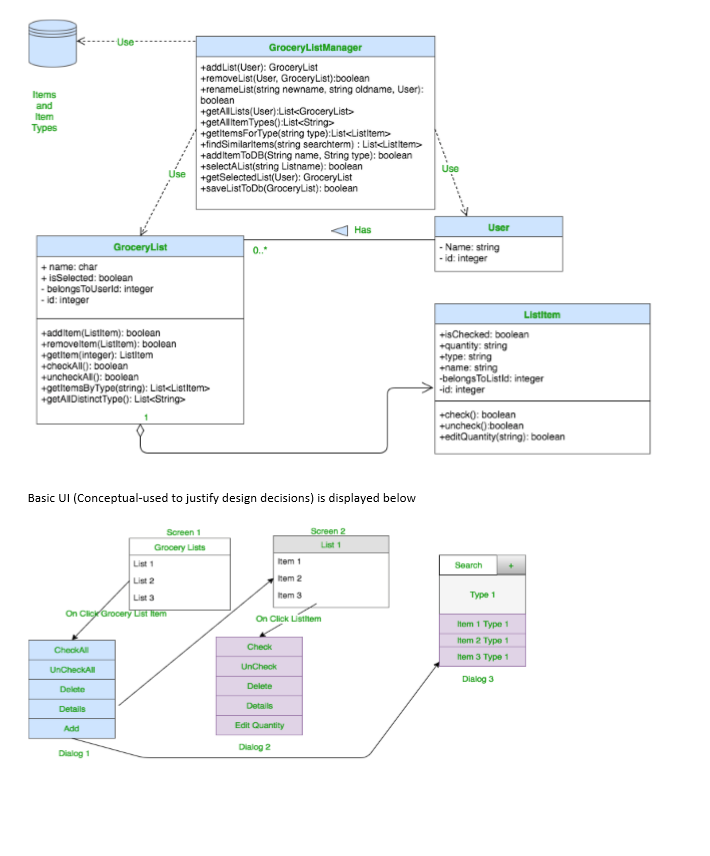
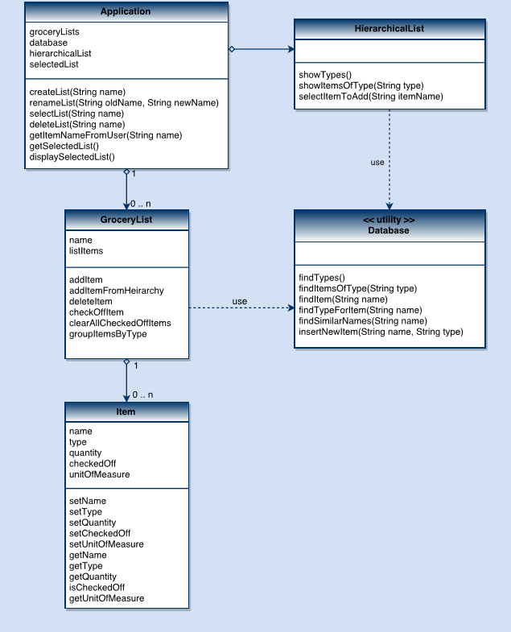
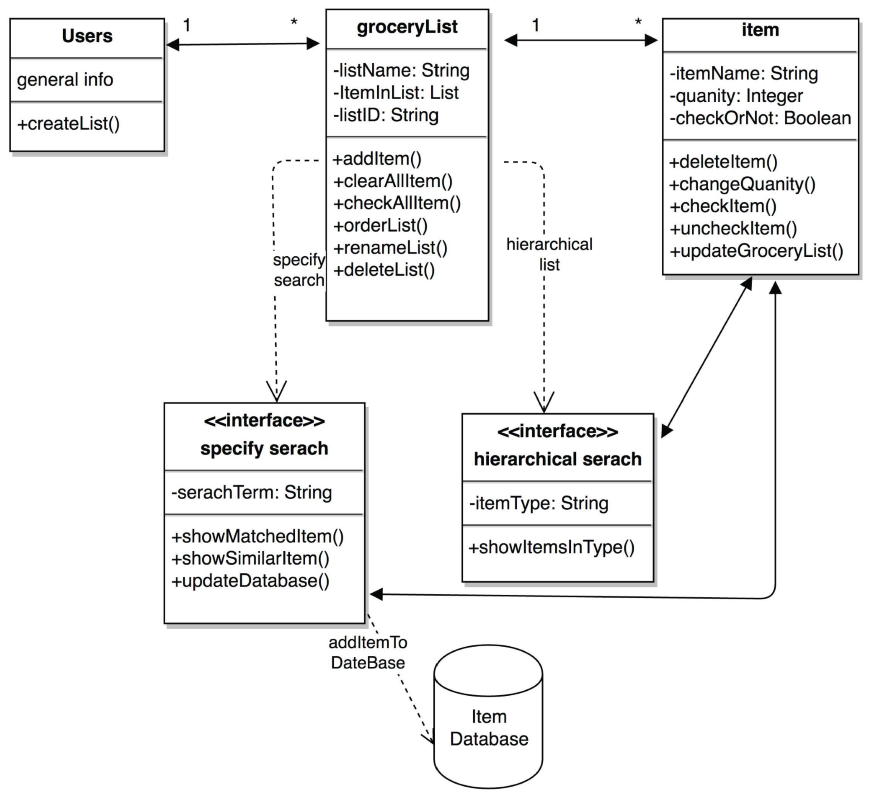
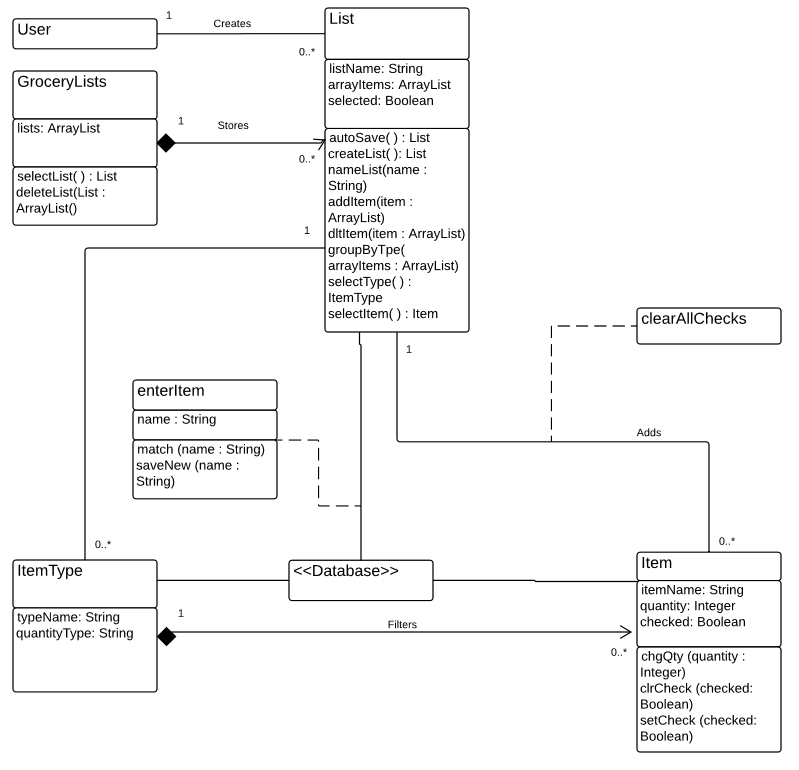
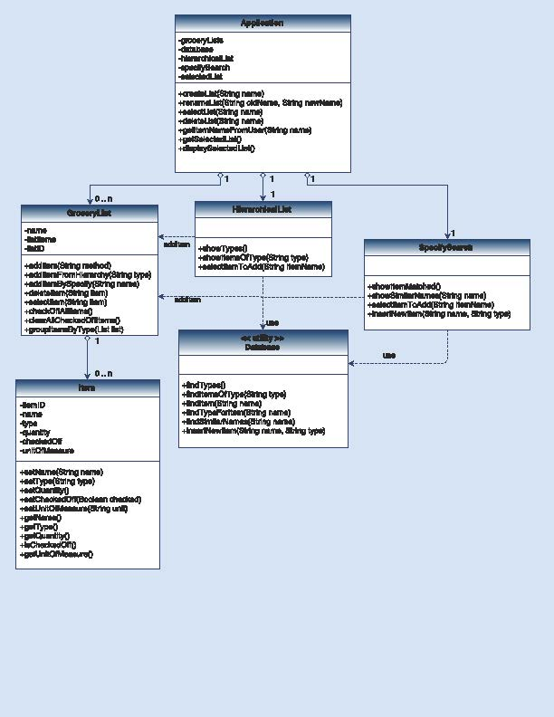

#**Design 1**

#

**Pros:** 

 - Separate Id attribute to handle duplicate names
 - Showed the UI design as well

**Cons:**

 - Database interaction class can be created which will be different from GroceryListManager class and handle all the different operations related to the database.
 - Make GroceryList communicate directly with the database or a utility class and reduce some dependence on the GroceryListManager class.

#**Design 2**

#

**Pros:** 

 - Database as a class eases the user’s operation
 - Designed based on 3 Tier software architecture

**Cons:**

 - HierachicalList class and addItemFromHeirarchy are redundant

#**Design 3**

#

**Pros:** 

 - Specify Search as a class allows a single point to add new items to database based on user input. 

**Cons:**

 - HierachicalList need to communicate with the database (missing)
 - Integer quantity without quantity type makes it difficult to handle units.

#**Design 4**

#

**Pros:** 

 - quantityType attribute in itemType allows specification of what kind of quantity is being used. E.g. bunches of cilantro or cans/bottles of coke etc. Different item types will likely use different quantity types. 

**Cons:**

 - clearAllChecks should be a method for the List instead of stand alone function
 - enterItem class should be a method for the List instead of a stand alone association class

#**Team Design**
#

We discussed about individual’s designs and adapted some concepts. The diagram is presented above.

The grocery list manager app is a single user application to buy items in the list from a grocery store. 

1. The Application class is the application layer of the design, which interacts with the UI and drives into the next layers. This class has attributes such as groceryLists, database, hierarchicalList, specifySearch, etc. The method createList() generates a new shopping list, renameList() renames the grocery list, selectList() allows the user to specify an active list, deleteList() deletes a list. The class also includes some other helper methods.

2. The user can mark a GroceryList as active list by using the selectList() method from the application class. The groceryList class has attributes listID (to handle duplicate names), name and listItems. There are several methods in the class that help manage the items in the list.  To add an item, users can select the addItem() method after which they can select an item either from addItemFromHierarchy() method or find an item using addItembySpecify() method. The two methods - addItemFromHierarchy() and addItembySpecify() are associated with HierachicalList and SpecifySearchList classes respectively (For the uses of those two classes, please refer to point 4 and 5). The deleteItem() method is called for deleting an item from the list. The checkOffAllItems() method will mark all items in the list as checked whereas the  clearAllCheckedOffItems() method will mark all items as unchecked. The gropupItemsByType() method helps group all listitems by type for a better user experience when this list is presented on the UI.

3. A grocerylist contains many items which are represented by the Item class. An Item can be selected from the grocery list using the selectItem() method. Each list item has attributes  itemID, name, type, quantity, checkedOff and unitOfMeasure. Several set methods are initiated when one item is added into the list from setName(), setType(), setCheckedOff(), setUnitOfMeasure(). All of these values are grabbed from the database via either addItemFromHierarchy() or addItembySpecify(). The user is prompted to input the quantity of the item from setQuantity(). The setCheckedOff() method will mark the item in the list to be checked or unchecked. 

4. Users can access the HierarchicalList class through Application or GroceryList. This class uses the utility class Database and shows the list of items of selected type. The user then has the option to add the selected item to the list. If the user accesses this class through application class, a temp list is created to hold the item. When an item is selected to add to the list, the values of this item is fetched from the database including name, ItemID, type, unitOfMeasure.

5. HeirarchicalList allows users to search for items to be added to the list. The database class method findSimilarItems() is used to find items with name similar to the given keyword and findItem() to find an item that can be added to the list. In addition, the user can create items if no match is found or from the top screen of this class by giving the initial attributes including name, type, unitOfMeasure etc. This method will write the new item into the database and into the list as well. When an item is selected to add into the list, the values of this items in the database are fetched from database including name, itemID(unique), type, unitOfMeasure.

6. The application must contain a database of items and corresponding item types. The items that are stored in this database will have attribute name, type, itemID(unique) and unitOfMeasure. Several methods are added to the database utility in order to handle database interactions. The findType() method will show all distinct item types in the database, the findItemsOfType() will take the type as an argument and present all the items of a certain type, the findItem() method finds an item with a specific name,  findTypeForItem() method is used to show the type attribute of the selected item,  findSimilarNames() method is used to find items that have similar names to the string argument passed in the method and insertNewItem() method is used to add new items into the database.

#**Summary**

For the team design we kept the database class as a separate utility class that would handle all database interactions. We decided to accommodate pros of all individual designs in order to create an improved team design.

User uses the application class in order to manage their lists
