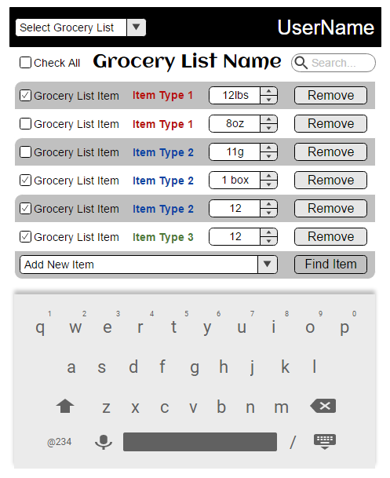
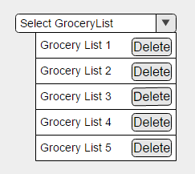
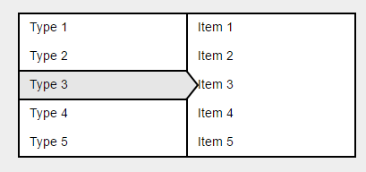

# Design Document
**Author**: **Anshul Goel, Dwight Nelson, Shu Xu, and Zakariya Ahmad**

## 1 Design Considerations
The application is a single user end operated in an android system for grocery lists management. This application will be operated independently by each end user, and the database will be updated by both user and database administrators.

### 1.1 Assumptions
The users will be required to open and navigate the interface via their android phones. They will be able to operate the software by clicking buttons, selecting radio button, check/uncheck boxes and typing in words and numbers via touch keys. The device has internet connections and will be able to pull remote data from a database server.
- the user will have access to a Android 4.0+ smart phone
- the parse.com data store will continue to operate through the use of the application
- the security of this application is not required
- no legal considerations are constraining for this application

### 1.2 Constraints
- the Programming language of the development is JAVA
- Operating system or platforms supported for the application is Android 4.0 +
- the platform for the development of this application is  Android Studio 2.0 and above
- the whole development of this application is about 80 hours and about 300 lines of code

### 1.3 System Environment

**Hardware:**

* Android phones
* Minimum network capability (at least one)
	* EDGE, HSPA, EV-DO, 802.11g
* Minimum memory and storage
	* Minimum 30mb of free storage to accomodate application and application data
* Display
	* Less than 6 inch screen size 
	* Supported resolutions: HDPI, XDPI, XXHDPI, XXXHDPI
	* Touchscreen capabilities

**Software**

* The minimum software requirements for this application will be Android API Level 19. 
* The Application will be developed using Java JDK 7
* 

## 2 Architectural Design

Our design encorporates a Three Tier architecture that decouples UI, Logic, and Data Storage components of the system. 

### 2.1 Component Diagram

The following diagram shows the overall system architecture and it's components. A Three Tier architecture that decouples UI, Logic, and Data Storage components of the system helps improve system maintainability.

#

### 2.2 Deployment Diagram

The components of this application are all held on a single device. We anticipate that the database size will be small enough to be kept withing the system. A deployment Diagram is unnecessary in this case.

## 3 Low-Level Design

*Describe the low-level design for each of the system components identified in the previous section. For each component, you should provide details in the following UML diagrams to show its internal structure.*

### 3.1 Class Diagram

*In the case of an OO design, the internal structure of a software component would typically be expressed as a UML class diagram that represents the static class structure for the component and their relationships.*

#

### 3.2 Other Diagrams
* 

## 4 User Interface Design

Base UI View for user
#

GroceryList Selection and Deletion
#

Hierarchical List for Item selection (Opened by Find Item Button in Base UI):
#
