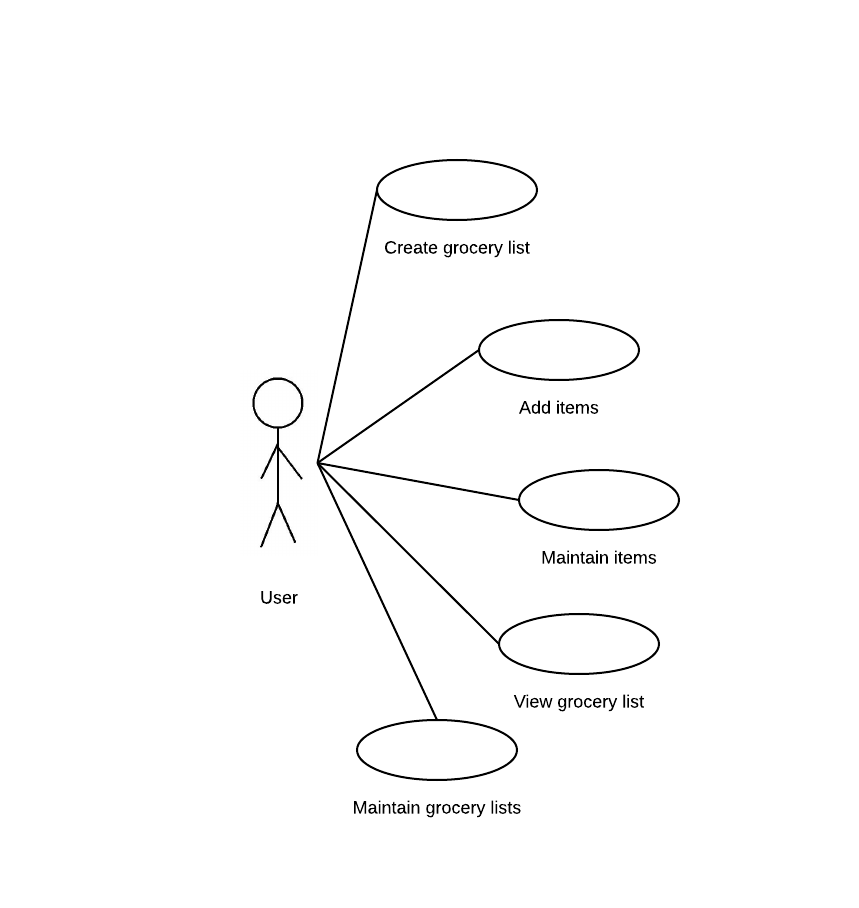

# Use Case Model

**Author**: Team 16: Anshul Goel, Dwight Nelson, Shu Xu, Zakariya Ahmad

## 1 Use Case Diagram

#

## 2 Use Case Descriptions

**Use Case 1:** Select the user

*Requirements:* This use case should allow the user to select cooresponding user to manager the grocery list(s) of Brad or Jeana to track items they need or want to purchase from a grocery store. 

*Pre-conditions:* None

*Post-conditions:* 

* The user is selected
* All the following activities are associcated with this user   

*Normal Scenario:*
   
* User opens application
* User selects the user
* Application prompts user manager list page for next activities

*Alternate Scenario:*

* User opens application
* User selects the user
* User clicks android backwards
* Application prompts back to select user page
* User selects the same user or the other user
* Application prompts user manager list page for next activities

**Use Case 2:** Create grocery list

*Requirements:* This use case should allow the user to create a new grocery list that can be used to track items they need or want to purchase from a grocery store. 

*Pre-conditions:* the specific user profile has been selected

*Post-conditions:* 

* A new grocery list is created
* The grocery list has a name    

*Normal Scenario:*
   
* User opens application
* User selects the matching user
* User clicks the add list
* Application prompts user to add list
* User selects option to add list
* Application prompts user to enter a name for the list
* User inputs desired name for list
* User clicks save 
* New grocery list with that name is created

*Alternate Scenario:*

* User opens application
* User selects the matching user
* User clicks the add list
* Application prompts user to add list
* Application prompts user to enter a name for the list
* User does not input a name for list
* User clicks save 
* Application cannot save without a name
* User input desired name for list
* User clicks save 
* New grocery list with that name is created

*Alternate Scenario 2:*

* User opens application
* User selects the matching user
* User clicks the add list
* Application prompts user to add list
* Application prompts user to enter a name for the list
* User inputs a name for the shopping list
* User does not clicks save but click android backwards key
* Application promotes to the user list profile page and the list is not saved
* User clicks the add list
* Application prompts user to add list
* Application prompts user to enter a name for the list
* User input desired name for list
* User clicks save 
* New grocery list with that name is created

**Use Case 3:** Add items by specific search

*Requirements:* This use case should allow the user to add items to an existing grocery list.

*Pre-conditions:*

* At least one grocery list has been created and is available for the user to select

*Post-conditions:* 

* An item must have been added to an existing grocery list as specified by the user

*Normal Scenario:*
   
* User opens application
* User selects user profile
* User selects a grocery list that was previously created
* Application has option for user to add item to the grocery list  
* User selects add item
* Application displays options to search by name or search by hierarchical list
* The user selects search by name
* User types in the name of item they want  
* Application lists similar items to inputted item name
* User can select item from drop down menu to add into the grocery list
* User selects item name from list
* User inputs item quantity 
* A new item with the properties specified by the user is added to the selected grocery list

*Alternate Scenario:*
* User opens application
* User selects user profile
* User selects a grocery list that was previously created
* Application has option for user to add item to the grocery list  
* User selects add item
* Application displays options to search by name
* The user selects search by name
* User types in the name of item they want  
* Application lists none match as the database does not the specific item 
* User can add a new item into the list and the database by clicking add button next the search text field
* Application prompts user to add the details of this item
* User selects item type through a dropdown menu 
* User puts in the quantity of item for the grocery list
* User inputs unit of measure
* A new item with the properties specified by the user is added to the selected grocery list
* A new item with the properties is also added to the database

**Use Case 4:** Add items by hierarchical search

*Requirements:* This use case should allow the user to add items to an existing grocery list.

*Pre-conditions:*

* At least one grocery list has been created and is available for the user to select
* The item to add has added into the database

*Post-conditions:* 

* An item must have been added to an existing grocery list as specified by the user

*Normal Scenario:*

* User opens application
* User selects user profile
* User selects a grocery list that was previously created
* Application has option for user to add item to the grocery list  
* User selects add item
* Application displays options to search by name or search by hierarchical list
* The user selects search by hierarchical list
* Application prompts the hierarchical search page
* User selects the type of the item from the dropdown menu
* User selects item name from the second dropdown menu
* User clicks add the item to the list
* User inputs item quantity 
* A new item with the properties specified by the user is added to the selected grocery list

*Alternate Scenario:*
* User opens application
* User selects user profile
* User selects a grocery list that was previously created
* Application has option for user to add item to the grocery list  
* User selects add item
* Application displays options to search by name or search by hierarchical list
* The user selects search by hierarchical list
* Application prompts the hierarchical search page
* User selects the wrong type of the item from the dropdown menu
* User selects item wrong name from the second dropdown menu
* User finds out a wrong item was selected
* User clicks backwards button to hierarchical search
* User selects the right type of the item from the dropdown menu
* User selects item right name from the second dropdown menu
* User clicks add the item to the list
* User inputs item quantity 
* A new item with the properties specified by the user is added to the selected grocery list

**Use Case 5:** Maintain lists

*Requirements:* This use case should allow the user to rename or remove a list

*Pre-conditions:*

* There exists at least one grocery list

*Post-conditions:* 

* The appropriate modifications to the user specified the list and saved the modifications
*Normal Scenario:*
   
* User opens application
* User selects a user profile
* User to edit or delete next to each list
* If user selects edit:
	* Application prompts user to rename the list
	* User gives a new name to the list
* If user selects delete:
	* The list is removed from the grocery list
* User is returned to the grocery list view 

*Alternate Scenario:*
   
* User opens application
* User is viewing list of all available grocery lists
* Application has delete button available
* User selects delete button next to list they want to remove
* Application confirms user wants to delete list
* User confirms they want to delete list
* User is returned to the grocery list view with appropriate list removed from the list

*Alternate Scenario 2:*
   
* User opens application
* User is viewing list of all available grocery lists
* Application has edit button available
* User selects edit button next to list they want to make changes to
* Application prompts user to rename list
* User does not enter new name for grocery list
* User is returned to the grocery list view with no changes made to list name
*

**Use Case 6:** Maintain an item of a list

*Requirements:* This use case should allow the user to modify an item's quantity and remove an item from a list

*Pre-conditions:*

* There exists at least one grocery list, which contains at least one item

*Post-conditions:* 

* The appropriate modifications to the user specified item have been made and saved to the grocery list which contains it

*Normal Scenario:*
   
* User opens application
* User selects a user profile
* User selects a grocery list
* Application prompts user to edit or delete next to each item
* If user selects edit:
	* Application prompts user to change quantity
	* User changes quantity
* If user selects delete:
	* The item is removed from the grocery list
* User is returned to the grocery list view 

**Use Case 7:** Check and uncheck the items of a grocery list

*Requirements:* This use case should allow the user to view a specified grocery list and check off or uncheck off items 

*Pre-conditions:*

* There exists at least one grocery list, which contains at least one item

*Post-conditions:* 

* Items that the user has acquired is checked off or unchecked off in the grocery list 

*Normal Scenario:*
   
* User opens application
* User selects user profile
* User selects a grocery list that was previously created
* User scrolls to the item they are looking for
* User clicks the check/uncheck box for this items
* The status of this items is marked as checked off or unchecked off

*Alternate Scenario:*
   
* User opens application
* User selects user profile
* User selects a grocery list that was previously created
* User clicked check off all box or clicked clear all box at the bottom 
* The status of all items in this list is marked as checked off or unchecked off

