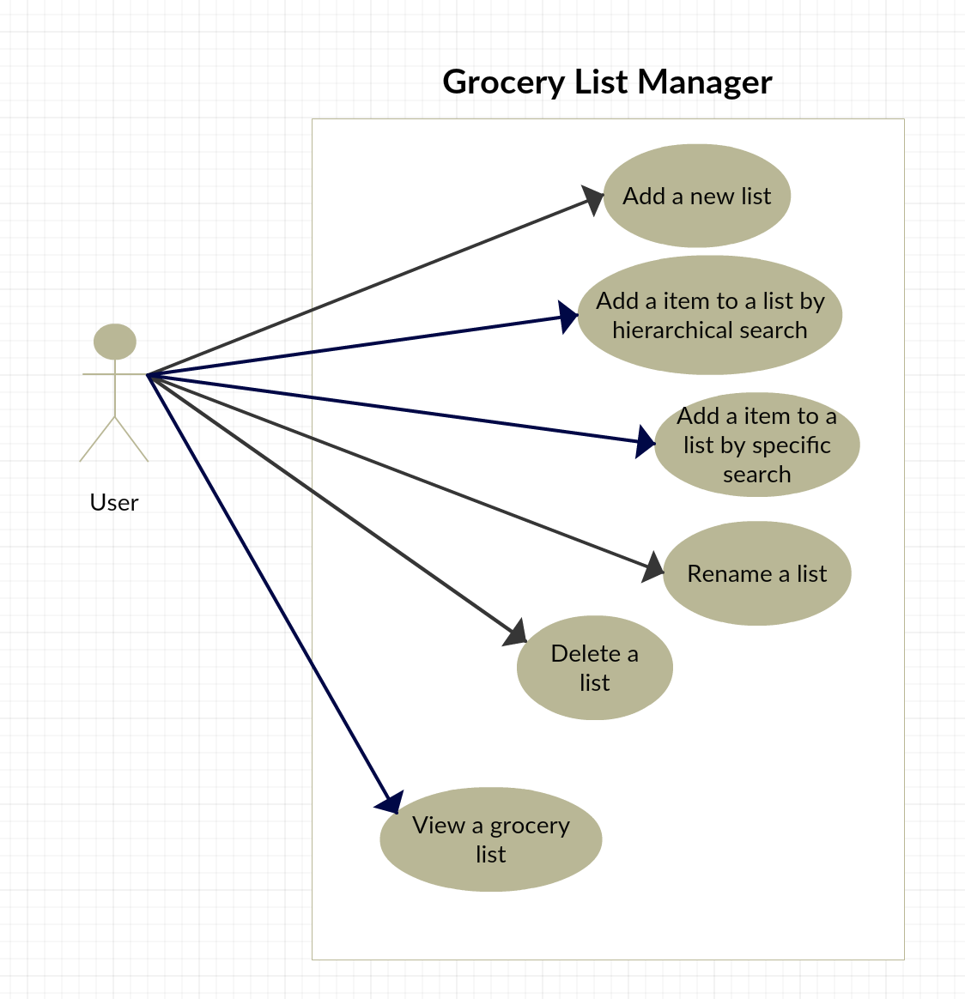

# Use Case Model

**Author**: Team 16: Anshul Goel, Dwight Nelson, Shu Xu, Zakariya Ahmad

## 1 Use Case Diagram

#

## 2 Use Case Descriptions

**Use Case 1:** Create grocery list

*Requirements:* This use case should allow the user to create a new grocery list that can be used to track items they need or want to purchase from a grocery store. 

*Pre-conditions:* None

*Post-conditions:* 

* A new grocery list is created
* The grocery list has a name    

*Normal Scenario:*
   
* User opens application
* User selects the matching profile
* Application prompts user to add list
* User selects option to add list
* Application prompts user to enter a name for the list
* User inputs desired name for list
* User clicks save 
* New grocery list with that name is created

*Alternate Scenario:*

* User opens application
* User selects the matching profile
* Application prompts user to add list
* Application prompts user to enter a name for the list
* User does not input a name for list
* User clicks save 
* Application cannot save without a name
* User input desired name for list
* User clicks save 
* New grocery list with that name is created

**Use Case 2:** Add items

*Requirements:* This use case should allow the user to add items to an existing grocery list.

*Pre-conditions:*

* At least one grocery list has been created and is available for the user to select

*Post-conditions:* 

* An item must have been added to an existing grocery list as specified by the user

*Normal Scenario:*
   
* User opens application
* User selects user profile
* User selects a grocery list that was previously created
* Application has option for user to add item to the grocery list  
* User selects add item
* Application displays options to search by name or search by hierarchical list
* The user selects search by name
* User types in the name of item they want  
* Application lists similar items to inputted item name
* User can select item from list or choose to add a new item if none match
* User selects item name from list
* User inputs item quantity 
* A new item with the properties specified by the user is added to the selected grocery list

*Alternate Scenario:*
* User opens application
* User selects user profile
* User selects a grocery list that was previously created
* Application has option for user to add item to the grocery list  
* User selects add item
* Application displays options to search by name or search by hierarchical list
* The user selects search by name
* User types in the name of item they want  
* Application lists similar items to inputted item name
* User can select item from list or choose to add a new item if none match
* User selects item name from list
* User inputs item quantity 
* User selects to add new item, not in list
* User inputs item type
* User inputs quantity
* User inputs unit
* A new item with the properties specified by the user is added to the selected grocery list

**Use Case 3:** Maintain items

*Requirements:* This use case should allow the user to modify an item's quantity and remove an item from a list

*Pre-conditions:*

* There exists at least one grocery list, which contains at least one item

*Post-conditions:* 

* The appropriate modifications to the user specified item have been made and saved to the grocery list which contains it

*Normal Scenario:*
   
* User opens application
* User selects a user profile
* User selects a grocery list
* Application prompts user to edit or delete next to each item
* If user selects edit:
	* Application prompts user to change quantity
	* User changes quantity
* If user selects delete:
	* Application confirms that user wants to delete item
	* User confirms
	* The item is removed from the grocery list
* User is returned to the grocery list view 

**Use Case 4:** View grocery list

*Requirements:* This use case should allow the user to view a specified grocery list and check off items as they attain them

*Pre-conditions:*

* There exists at least one grocery list, which contains at least one item

*Post-conditions:* 

* Items that the user has acquired and specified are checked off in the grocery list 

*Normal Scenario:*
   
* User opens application
* User selects user profile
* User selects a grocery list that was previously created
* User scrolls to the item they are looking for
* If user has not acquired specified item, no changes are made
* If user has acquired specified item, user selects the item checkbox
* User is returned to the grocery list view 

**Use Case 5:** Maintain grocery lists

*Requirements:* This use case should allow the user to modify or delete existing grocery lists

*Pre-conditions:*

* There exists at least one grocery list

*Post-conditions:* 

* User specified actions to grocery list have been made and saved

*Normal Scenario:*
   
* User opens application
* User is viewing list of all available grocery lists
* Application has edit button available
* User selects edit button next to list they want to make changes to
* Application prompts user to rename list
* User enters new name for grocery list
* User is returned to the grocery list view with appropriate changes saved

*Alternate Scenario:*
   
* User opens application
* User is viewing list of all available grocery lists
* Application has delete button available
* User selects delete button next to list they want to remove
* Application confirms user wants to delete list
* User confirms they want to delete list
* User is returned to the grocery list view with appropriate list removed from the list

*Alternate Scenario 2:*
   
* User opens application
* User is viewing list of all available grocery lists
* Application has edit button available
* User selects edit button next to list they want to make changes to
* Application prompts user to rename list
* User does not enter new name for grocery list
* User is returned to the grocery list view with no changes made to list name