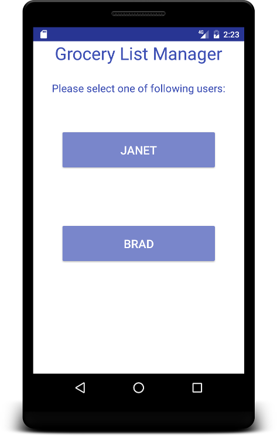
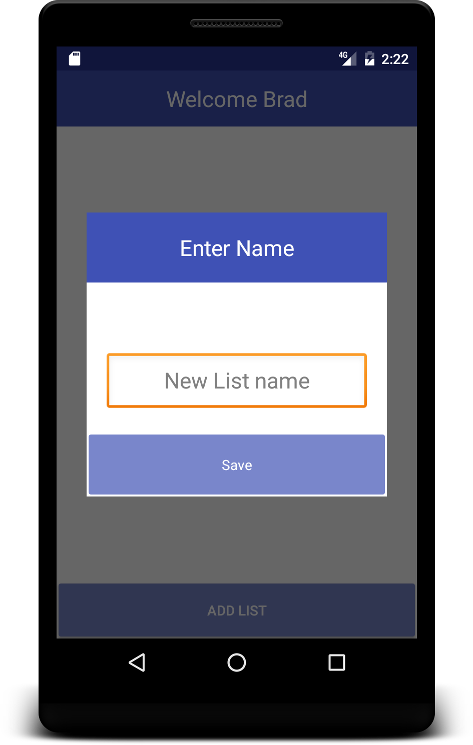
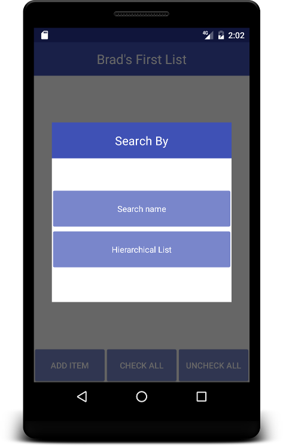
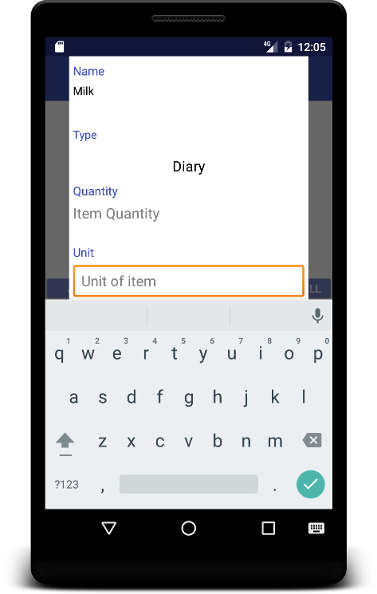
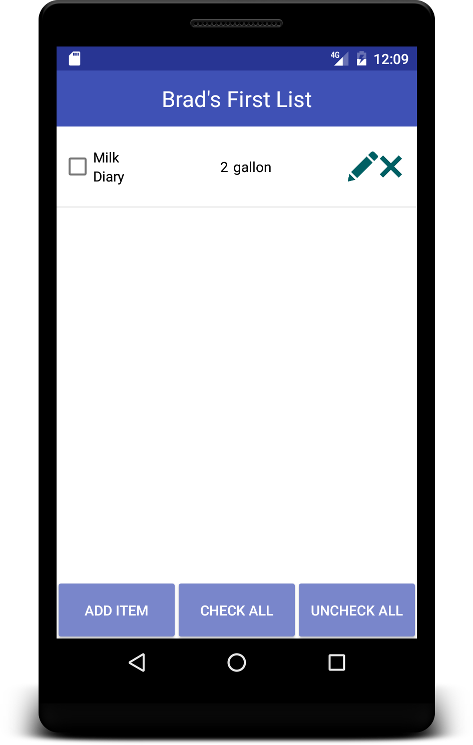

#USER MANUAL FOR GLM

## 1 Overview

This document provides a basic guide for users of the GLM (Grocery List Manager) application. The following sections will describe user tasks and how the user should interact with the application to perform those tasks.
  
## 2 Working With Users/Profiles

When the application starts, the user is presented with a list of usernames/profiles to choose from. Selecting a username/profile gives the current user access to grocerylists under that profile.

:arrow_down_small: Profile Screen
#

* CHANGE User: User can click native backwards key from your device to go back to the previous page

:scroll: _STEPS_
* STEP 1: Select User/Profile

## 3 Working With Grocery Lists
After selecting a user profile a screen is displayed that contains the selected user's grocery lists.

### 3.1 Creating Lists
To create a list on this screen the user is given an "Add List" button at the bottom of the screen.

:arrow_down_small: Grocery List Screen Empty
#

:arrow_down_small: Grocery List screen after "Add List" button is clicked
#

:arrow_down_small: Grocery List screen after updating the name for the new Grocery List
#

:arrow_down_small: Grocery List screen after the new list is added
#

* CANCEL the action : User can click native backwards key from your device to go back to the previous page

:scroll: _STEPS_
* STEP 1: Select Add List.
* STEP 2: Enter a name for the grocery list.
* STEP 3: Select Save

### 3.2 Renaming Lists
After a list is added to the profile, there is an option to rename the list by selecting the  button.

:arrow_down_small: Renamed List
#

* CANCEL the action : User can click native backwards key from your device to go back to the previous page

:scroll: _STEPS_
* STEP 1: Select Pencil Icon.
* STEP 2: Enter a name for the grocery list.

### 3.3 Removing Lists
After a list is added to the profile, there is also an option to remove the list by selecting the   button.

:arrow_down_small: List Removed
#

:scroll: _STEPS_
* STEP 1: Select X button.
* STEP 2: Observe that the selected list has been removed.

## 4 Working With Grocery List Items

:arrow_down_small: Item Screen
#

### 4.1 Adding Items

:arrow_down_small: Screen shown after "Add Item" clicked 
#

* CANCEL the action : User can click native backwards key from your device to go back to the previous page

#### 4.1.1 Text Search

:arrow_down_small: Screen shown after "Search Name" clicked
#

:arrow_down_small: Editing the search criteria
#

:arrow_down_small: Screen shown after the add button is clicked
#

:arrow_down_small: Editing the new item
#

:arrow_down_small: Item added to list
#

:scroll: _STEPS_
* STEP 1: Select Add Item
* STEP 2: Select Search Name
* STEP 3: Type in Item Name
* STEP 4: Select Add
* STEP 5: Set the Item's type, quantity, and unit
* STEP 6: Select Save
* STEP 7: Observe that the new item has been added to the list

#### 4.1.2 Hierarchical Search

:arrow_down_small: Screen shown after clicking "Hierarchical List" is clicked
#

### 4.2 Removing Items

After an item is added to the list, there is an option to remove the item by selecting the  button next to the item.

:scroll: _STEPS_
* STEP 1: Select X button.
* STEP 2: Observe that the selected item has been removed.

### 4.3 Checking Off Items

After an item is added to the list, there is an option to check off the item by selecting the check box next to the item.

:arrow_down_small: Screen shown when no items are checked off or "uncheck all" is clicked
#

:arrow_down_small: Screen shown when one item is checked off
#

:arrow_down_small: Screen shown when all items are checked off or "check all" is clicked
#

:scroll: _STEPS_
* STEP 1: Click an empty checkbox.
* STEP 2: Observe that the cooresponding item is checked off.
* STEP 3: Click the Check All button
* STEP 4: Observe that all items are checked off
* STEP 5: Click Uncheck All
* STEP 6: Observe that all items are unchecked

### 4.4 Editing Items

After a list is added to the profile, there is also an option to remove the list by selecting the  button.

:arrow_down_small:  Screen shown after edit icon clicked
#

:arrow_down_small: Editing (Allows user to modify product quantity)
#

:arrow_down_small: Item changes saved
#

:scroll: _STEPS_
* STEP 1: Click the edit icon for an item.
* STEP 2: Modify the items quantity 
* STEP 3: Click Save
* STEP 4: Observe that the item's quantity has changed

## 5 Conclusion
This is the alpha version of grocery list manger. It has the ability to add/edit shopping list, add item to the list by hierarchical search or specified name search. In addition, users can add item by specified search and save it to database for future use and add it to current list.

