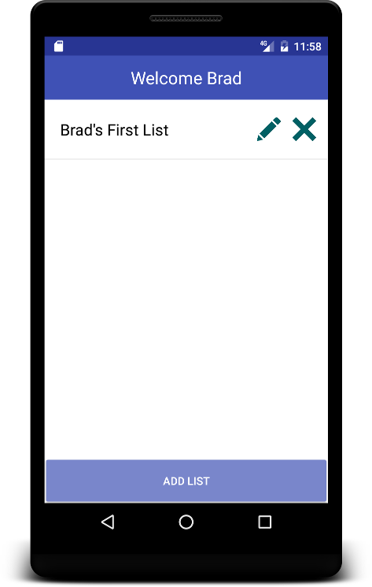
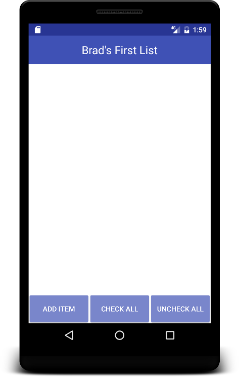
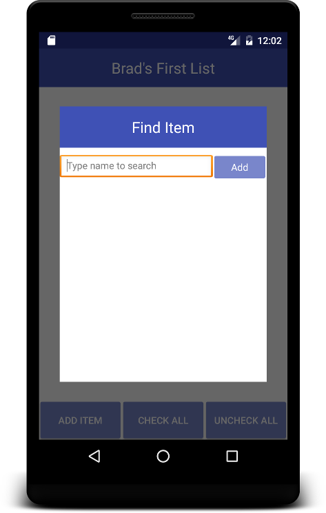
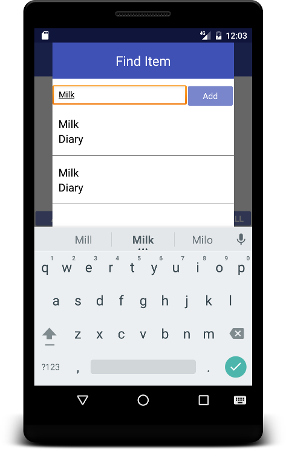
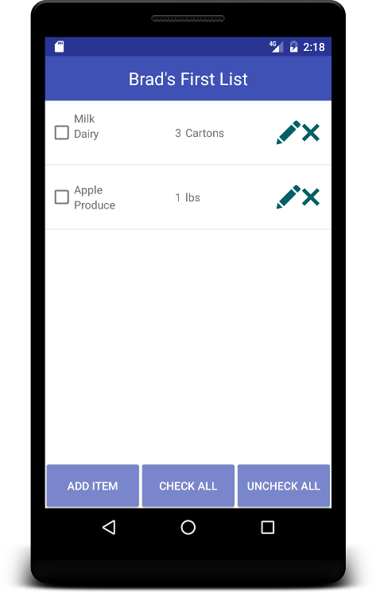
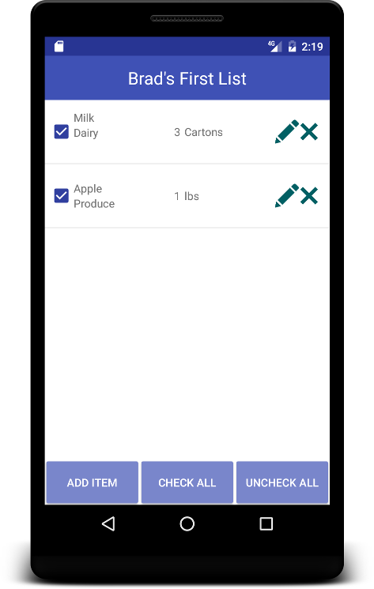
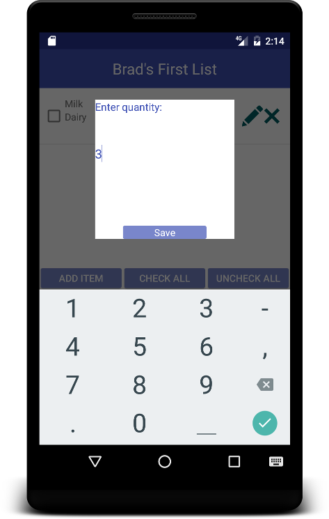

#USER MANUAL FOR GLM

## 1 Overview

This document provides a basic guide for users of the GLM (Grocery List Manager) application. The following sections will describe user tasks and how the user should interact with the application to perform those tasks.
  
## 2 Working With Users/Profiles

When the application starts, the user is presented with a list of usernames/profiles to choose from. Selecting a username/profile gives the current user access to grocerylists under that profile.

#

:scroll: _STEPS_
* STEP 1: Select User/Profile

## 3 Working With Grocery Lists
After selecting a user profile a screen is displayed that contains the selected user's grocery lists.

### 3.1 Creating Lists
To create a list on this screen the user is given an "Add List" button at the bottom of the screen.

#

#

#

#

:scroll: _STEPS_
* STEP 1: Select Add List.
* STEP 2: Enter a name for the grocery list.
* STEP 3: Select Save

### 3.2 Renaming Lists
After a list is added to the profile, there is an option to rename the list by selecting the pencil icon button.

#

>*ADD (Rename List Screen) SCREENSHOT HERE*

:scroll: _STEPS_
* STEP 1: Select Pencil Icon.
* STEP 2: Enter a name for the grocery list.

### 3.3 Removing Lists
After a list is added to the profile, there is also an option to remove the list by selecting the X button.

#

>*ADD (list removed) SCREENSHOT HERE*

:scroll: _STEPS_
* STEP 1: Select X button.
* STEP 2: Observe that the selected list has been removed.

## 4 Working With Grocery List Items

#

### 4.1 Adding Items

#

#### 4.1.1 Text Search

#

#

#

#

#

#### 4.1.2 Hierarchical Search

#

### 4.2 Removing Items

### 4.3 Checking Off Items

#

#

#

### 4.4 Editing Items

#

#

#

## 5 Conclusion
This is the alpha version of grocery list manger. It has the ability to add/edit shopping list, add item to the list by hierarchical search or specified name search. In addition, user can add item by specified search and save it to database for future use and add it to current list.

